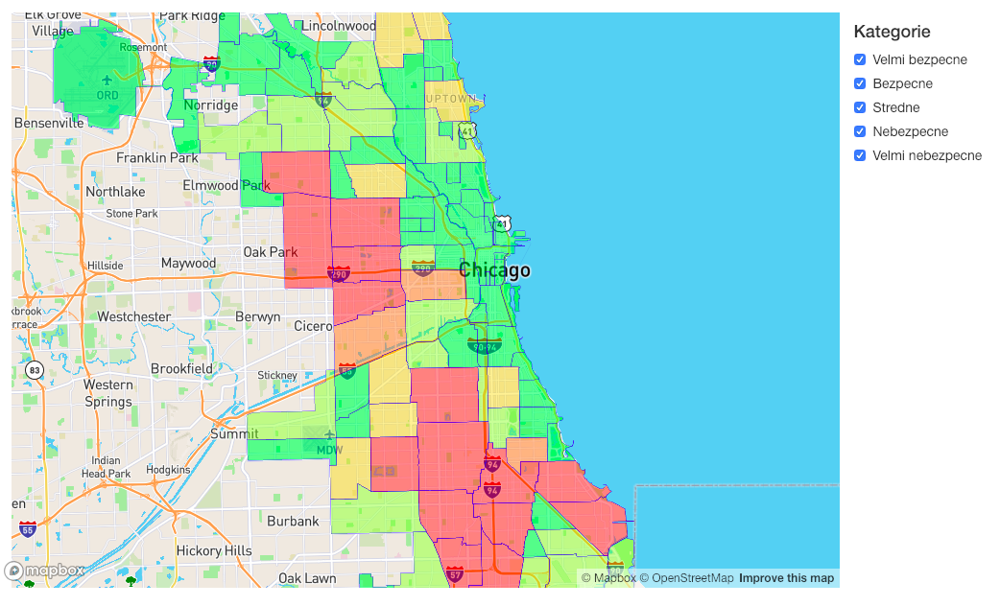
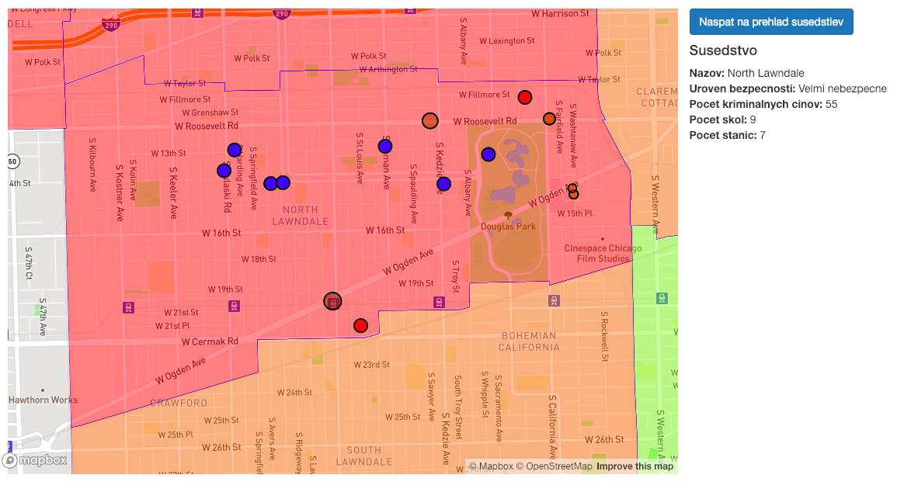
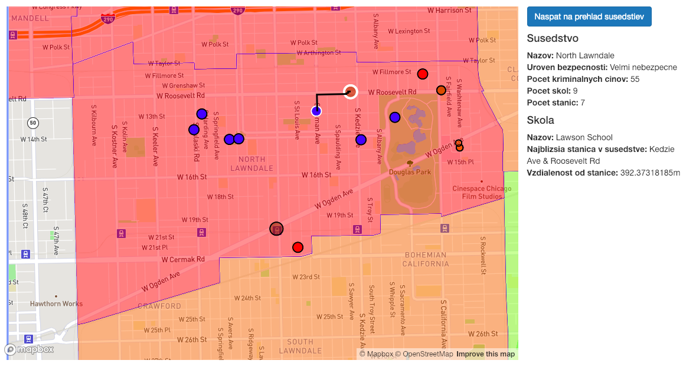
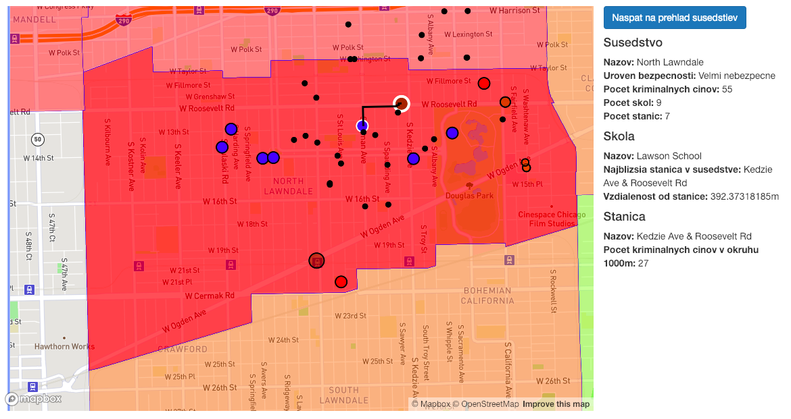
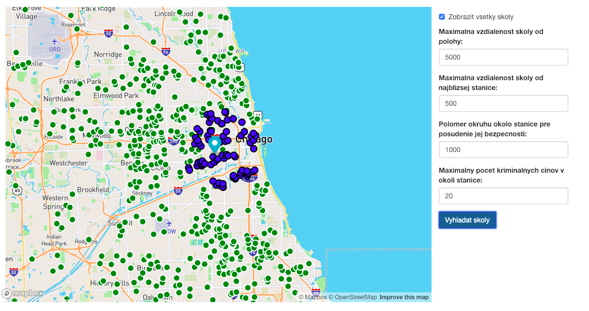

# Prehľad

Aplikácia je zameraná na zobrazenie informácií o školách, cyklistických staniciach a kriminalite v oblasti Chicaga. Funkciami aplikácie sú:
- zobrazenie susedstiev s informáciou o ich kriminalite + filtrovanie
- zobrazenie detailu susedstva
- zobrazenie škôl v susedstve
- zobrazenie cyklistických staníc v susedstve
- zobrazenie trasy od školy k najbližšej cyklistickej stanici
- zobrazenie kriminálnych činov v okolí cyklistickej stanice
- vyhľadávanie škôl

Jednotlivé funkcie sú rozdelené do 2 obrazoviek:
- Prieskumník
- Vyhladávač škôl

Z technologické hľadiska je aplikácia rozdelená na 3 časti:
- frontend
- backend
- databáza

Aplikácia je postavená na PHP frameworku Laravel, pričom na frontende využíva MapBox. Databáza je PostgreSQL s využitím PostGIS rozšírenia. Frontend využíva JavaScript a jQuery, pričom s backendom komunikuje s využitím jQuery Ajax prostredníctvom dopytov na API.

# Frontend

Frontendová časť využíva štýlovaciu syntax Laravel Blade. Jednotlivé podstránky `explore.blade.php` a `search.blade.php` majú spoločný základ v podobe `layout.blade.php`. Každá podstránka má svoj JavaScript kód vložený v sekcií \<script\>.

Na zobrazovanie mapy je použitý MapBox. V rámci mapboxu sú zobrazované jednotlivé informácie, ako napríklad susedstvá, školy a podobne.

Na frontendovej časti sa taktiež nachádza logika filtrovania (s využitím vrstiev mapboxu) a zobrazovanie informácií o entitách.

Keďže API vracia dáta vo formáte `GeoJSON`, jednotlivé zdroje dát pre vrstvy je možné vytvárať priamo vytvorením vrstvy, ktorej zdrojom je prijatý JSON objekt (nie je potrebné iterovať cez žiadne pole).

# Backend

Backend aplikácia je založená na PHP frameworku Laravel a využíva jednotlivé mechanizmy frameworku tak, ako to odporúča dokumentácia. Mapovanie API ciest na metódy sa nachádza v `api.php` a cesty aplikácie sa nachádzajú v `web.php`.

Volania z `web.php` sú smerované na `PageController`, zatiaľ čo API volania sú smerované na `MapController`, ktorého funkciami sú práce s mapovými dátami.

Na konverziu dát z databázy do formátu GeoJSON sú vytvorené pomocné metódy `asFeature` a `asFeatureCollection`. Tieto metódy konvertujú objekty a polia na korektné GeoJSON Features.

## Data

Dáta pre aplikáciu sú kombinované zo štyroch zdrojov. Informácie o školách pochádzajú z OpenStreetMaps. Tieto dáta obsahovali rozsiahle informácie o oblasti Chicaga. Dáta som naimportoval do databázy prostredníctvom `osm2pgsql`. Dáta o kriminálnych činoch a cyklistických staniciach som získal z portálu `Kaggle`. Tieto dáta som predspracoval prostredníctvom skriptov `parser_cycling.py` a `parser_crimes.py`. Predspracované dáta som vložil do databázových tabuliek `crimes` a `stations` príkazom `INSERT` s použitím mapovej funkcie `ST_MakePoint`. Dáta o susedstvách v Chicagu pochádzajú z Chicago Data Portalu, odkiaľ som ich stiahol a vložil do databázy prosredníctvom `osm2psql` do tabuľky `neighborhoods`.

Pri práci s dátami využívam mapové funkcie:
- ST_DWithin
- ST_Transform
- ST_MakePoint
- ST_AsGeoJson
- ST_Distance

# Prípady použitia

## Zobrazenie susedstiev

### Ukážka

### Query
~~~~sql
SELECT
	neighborhoods.gid AS id,
    ST_AsGeoJSON(ST_Transform(neighborhoods.geom, 4326))::json AS geom,
    neighborhoods.pri_neigh AS title,
    COUNT(crimes.id) AS crimes_count
FROM neighborhoods LEFT JOIN crimes 
ON ST_Contains(neighborhoods.geom, crimes.geo) 
GROUP BY neighborhoods.gid
~~~~

[EXPLAIN](/explains/query1.json)

### Popis
Zobrazenie všetkých susedstiev spolu s informáciou o ich kriminalite. Farba susedstva je závislá od počtu kriminálnych činov. Susedstvá je možné filtrovať podľa úrovne kriminality. Toto filtrovanie sa vykonáva na frontende vďaka využitiu vrstiev, avšak pripravená je aj implementácia, ktorá by filtrovala na úrovni dopytu do databázy.

## Zobrazenie detailu susedstva

### Ukážka

### Popis
Po kliknutí na niektoré susedstvo sa mapa automaticky priblíži k detailu daného susedstva. V bočnom panely sú zobrazené detaily o susedstve. Prostredníctvom tlačidla Naspäť na prehľad susedstiev je možné sa vráťiť na prehľad susedstiev.

## Zobrazenie škôl v susedstve

### Ukážka

### Query
~~~~sql
WITH
    neighborhood AS (SELECT geom FROM neighborhoods WHERE gid = ?),
    all_schools AS (SELECT osm_id, name, way FROM planet_osm_point WHERE amenity = 'school'),
    schools AS (SELECT osm_id, name, way FROM all_schools JOIN neighborhood ON ST_Contains(ST_Transform(neighborhood.geom,4326), ST_Transform(all_schools.way, 4326)))
SELECT
    schools.osm_id AS id,
    ST_AsGeoJSON(ST_Transform(schools.way, 4326))::json AS geom,
    schools.name AS school_title,
    station.dist AS station_distance,
    station.name AS station_title
FROM schools
CROSS JOIN LATERAL
    (SELECT
        stations.name,
        ST_Distance(ST_Transform(schools.way, 4326)::geography,ST_Transform(stations.geo, 4326)::geography) as dist
     FROM stations
     ORDER BY dist
     LIMIT 1
    ) AS station
~~~~

[EXPLAIN](/explains/query2.json)

### Popis
Pri detaile susedstva sú zobrazené školy, ktoré sa v ňom nachádzajú. Farba školy je závislá od vzialenosti najbližšej stanice. Ak sa najbližšia stanica nachádza bližšie ako 300m, škola je červená, inak je modrá.

## Zobrazenie cyklistických staníc v susedstve

### Ukážka

### Query
~~~~sql
WITH
    neighborhood AS (SELECT geom FROM neighborhoods WHERE gid = ?)
SELECT
    stations.id,
    stations.name,
    ST_AsGeoJSON(ST_Transform(stations.geo, 4326))::json AS geom,
    count(crimes.id) AS count
FROM neighborhood
LEFT JOIN stations
ON ST_Contains(ST_Transform(neighborhood.geom,4326), ST_Transform(stations.geo, 4326))
LEFT JOIN crimes
ON ST_DWithin(stations.geo::geography, crimes.geo::geography, 1000)
GROUP BY stations.id  
~~~~

[EXPLAIN](/explains/query3.json)

### Popis
Okrem škôl sú pri detaile susedstva zorazené aj cyklistické stanice. Veľkosť krúžku stanice je exponenciálne závislý od počtu kriminálnych činov, ktoré sa stalo v okruhu 1000m.

## Zobrazenie cesty od školy k najbližšej cyklistickej stanici

### Ukážka

### Query
~~~~sql
WITH
    school AS (SELECT way FROM planet_osm_point WHERE osm_id = ?),
    neighborhood AS (SELECT geom FROM neighborhoods WHERE gid = ?),
    stations_in_neighborhood AS (SELECT * FROM stations JOIN neighborhood ON ST_Contains(ST_Transform(neighborhood.geom,4326), ST_Transform(stations.geo, 4326)))
SELECT
    station.id AS id
FROM school
CROSS JOIN LATERAL
    (SELECT
        stations_in_neighborhood.*
    FROM stations_in_neighborhood
    ORDER BY ST_Distance(ST_Transform(school.way, 4326)::geography,ST_Transform(stations_in_neighborhood.geo, 4326)::geography)
    LIMIT 1
) AS station
~~~~

[EXPLAIN](/explains/query4.json)

### Popis
Po kliknutí na školu sa bielym obvodom vyznačí škola a jej najbližšia stanica v danom susedstve. Okrem toho sa zobrazí aj cesta k tejto stanici. Na zobrazenie cesty sa využíva služba MapBox routes, do ktorej sa odošlú informácie o štartovej a cieľovej lokácií, pričom služba vráti cestu vo formáte GeoJson.

## Zobrazenie kriminálnych činov v okolí cyklistickje stanice

### Ukážka

### Query
~~~~sql
SELECT crimes.id AS id, ST_AsGeoJSON(ST_Transform(crimes.geo, 4326))::json AS geom, crimes.type AS crime_type, crimes.description AS crime_description
FROM crimes
JOIN stations
ON ST_DWithin(stations.geo::geography, crimes.geo::geography, 1000)
WHERE stations.id = ?
~~~~

[EXPLAIN](/explains/query5.json)

### Popis
Keď používateľ zájde myšou na niektorú cyklistickú stanicu, zobrazia sa kriminálne činy v okolí 1000m.

## Vyhľadávanie škôl

### Ukážka

### Query
~~~~sql
WITH
    schools AS (SELECT osm_id, way, name FROM planet_osm_point WHERE amenity = ?)
SELECT
    schools.osm_id AS id,
    ST_AsGeoJSON(ST_Transform(schools.way, 4326))::json AS geom,
    schools.name AS school_title
FROM schools
~~~~

[EXPLAIN](/explains/query6.json)

~~~~sql
WITH
    schools AS (SELECT osm_id, way, name FROM planet_osm_point WHERE amenity = ? AND ST_DWithin(ST_Transform(way, 4326)::geography, ST_MakePoint(?, ?, 4326)::geography, ?)),
    stations AS (SELECT stations.id, stations.name, stations.geo, count(crimes.id) AS crimes_count FROM stations LEFT JOIN crimes ON ST_DWithin(stations.geo::geography, crimes.geo::geography, ?) GROUP BY stations.id HAVING count(crimes.id) <= ?)
SELECT 
    schools.osm_id AS id,
    ST_AsGeoJSON(ST_Transform(schools.way, 4326))::json AS geom,
    schools.name AS school_title,
    station.dist AS station_distance,
    station.name AS station_title,
    station.crimes_count AS station_crimes_count
FROM schools
CROSS JOIN LATERAL
    (SELECT
        stations.name,
        ST_Distance(ST_Transform(schools.way, 4326)::geography,ST_Transform(stations.geo, 4326)::geography) as dist,
        stations.crimes_count
    FROM stations
    ORDER BY dist
    LIMIT 1
    ) AS station
WHERE station.dist <= ?
~~~~

[EXPLAIN](/explains/query7.json)

### Popis
Pri vyhľadávaní škôl najskôr používateľ nastaví svoju lokáciu prostredníctvom markeru. Následne vyplní jednotlivé požiadavky na túto školu a stanice v jej okolí. Po odoslaní vyhľadávania sa zodpovedajúce školy zobrazia na mape vyznačené modrou farbou. Používateľ si môže zvoliť, či chce mať na mape zobrazené všetky školy vyznačené zelenou farbou.

# Optimalizácie na úrovni databázy

## Vytvorenie indexov
V databáze som vytvoril indexy typu gist nad vhodnými stĺpcami:
- crimes.geo
- neighborhoods.geom
- planet_osm_line.way
- planet_osm_point.way
- planet_osm_polygon.way
- planet_osm_roads.way
- stations.geo

## Príkaz with
Prostredníctvom príkazu WITH som si na vhodných miestach zjednodušil tabuľky tak, aby som v ďalšej časti dopytu pracoval len s tými dátami, ktoré sú preň relevantné. Konkrétne ukážky sa nachádzajú pri opise prípadov použitia.